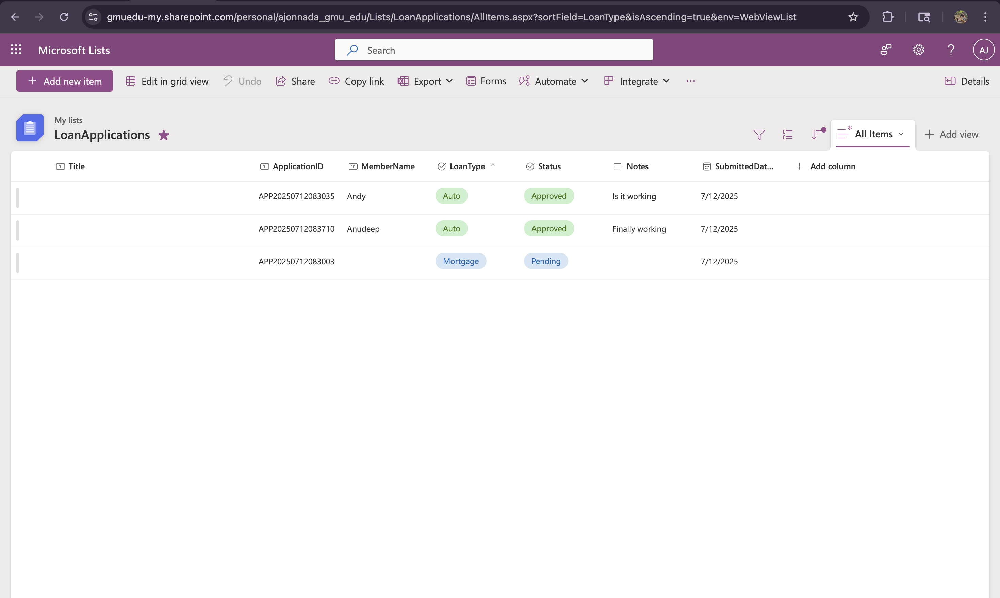

# Loan-Application-Status-Tracker
# 🏦 Loan Application Status Tracker

A modern low-code app built with Microsoft Power Platform to track, submit, and monitor loan applications securely using SharePoint, Power Automate, and Azure DevOps.

What makes this project unique is that I researched real user pain points on Reddit, where some Credit Union customers discussed delays, lack of transparency, and slow communication. I designed this solution specifically to address those complaints with a more responsive and secure loan tracking process.

---

## 🚀 Features
- 📋 Power Apps form to submit loan applications
- 🛡️ Azure AD login + audit logs with Application ID and timestamp
- 📧 Auto email notifications using Power Automate
- 📊 Power BI analytics for loan status & type (Windows only)
- 📁 SharePoint list backend with permission controls
- 📌 Agile tracking with Azure DevOps board

---

## 🛠️ Tech Stack

| Tool               | Purpose                    |
|--------------------|----------------------------|
| Power Apps         | UI form + logic (low-code) |
| SharePoint         | Data source (LoanApplications) |
| Power Automate     | Trigger + email flow       |
| Power BI (Windows) | Dashboard visualizations   |
| Azure DevOps       | Agile user stories & board |
| GitHub             | Documentation repository   |

---

## 📸 Demo and Screenshots 
🖼️ Power Apps Form
First, I designed a Power Apps form with fields like Member Name, Loan Type, Loan Status, and Notes. It also auto-generates a unique Application ID and captures the submission time.
 - 🎥 Demo Video: [Watch here](https://www.loom.com/share/a64b2b03b9ea4af8ac4a5ad07d4d5136?sid=9669bd45-ae43-43f8-a2bd-d6a894272221)


🗂️ SharePoint Integration
Each time the form is submitted, the data is securely saved in a SharePoint list called LoanApplications, which acts as the backend database.
 
 
📧 Power Automate Notification
Immediately after submission, a Power Automate flow is triggered that sends an automated email notification to the loan officer with the applicant’s details. This keeps the process transparent and responsive.

🔄 Azure DevOps Agile Process
To manage the development of this project, I used Azure DevOps with Agile methodology. I broke the work down into user stories and tracked tasks across sprints using a Kanban board with statuses like “To Do,” “Doing,” and “Done.”

---

## 🎓 Learning Highlights

- Used `Patch()` and `Set()` functions in Power Fx
- Implemented automated emails for workflow triggers
- Created audit logging for admin tracking
- Practiced Agile task breakdown and DevOps usage
- (Optional) Connected Power BI to SharePoint for analytics

---


## 📁 Folder Structure

```bash
Loan-Application-Status-Tracker/
├── README.md
├── AGILE.md
├── /screenshots/
├── /flows/
├── /docs/
└── demo_video.mp4
